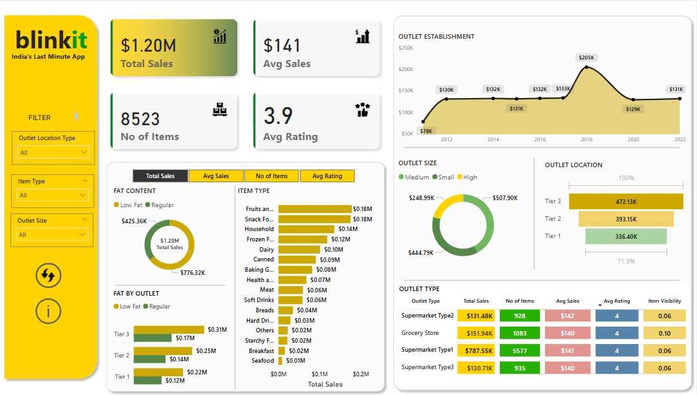

# 📊 Blinkit Analysis

This repository contains a Power BI dashboard that presents an insightful analysis of Blinkit's sales and performance data across different outlet types, sizes, and item categories.

---

## 📌 Project Description

The **Blinkit Power BI Dashboard** visualizes comprehensive sales performance metrics for Blinkit, an instant delivery service. 
This report helps stakeholders understand trends in total sales, average rating, item distribution, 
and outlet performance across various dimensions like outlet size, type, and item category.

---

## 🛠️ Technologies Used

- **Power BI** (Data Modeling & Visualization)
- **DAX** (Data Analysis Expressions for custom metrics)
- **Data Sources**: Assumed CSV/Excel or relational data inputs related to outlets, items, and transactions

---

## 📈 Features of the Report

- **Dynamic Filters**: Users can filter by:
  - Outlet Location Type
  - Item Type
  - Outlet Size

- **KPI Cards**:
  - Total Sales ($1.20M)
  - Average Sales ($141)
  - Number of Items (8,523)
  - Average Rating (3.9)

- **Visual Components**:
  - Donut charts for fat content and outlet size
  - Bar graphs for item type sales
  - Line chart showing outlet establishment trends (2012–2022)
  - Detailed breakdown by outlet location tier and outlet type

- **Data Drilldown**:
  - Outlet type performance (e.g., Supermarket Type1, Grocery Store)
  - Sales by fat content and outlet tier
  - Average rating and item visibility comparisons

---

## ❓ Key Questions Answered

- What is the total and average sales across outlets?
- Which item types contribute most to sales?
- How do sales and ratings vary across outlet types and tiers?
- How does outlet size impact performance metrics?
- What has been the trend in outlet establishments over time?

---

## 📷 Dashboard Preview

> 

